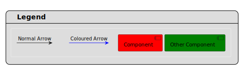
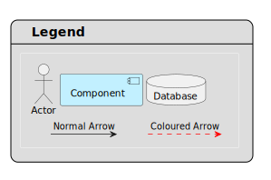

# Rich PlantUML Legend
A [PlantUML](https://plantuml.com) library that lets the user create a legend with rich formatting. Normally, PlantUML's legend box can only contain text formatted with the [Creole syntax](https://plantuml.com/creole). This library works around this limitation to insert sub-diagrams within the legend box.

## Usage
The simplest way to use this library is to include it from github, using the following line at any place in your PlantUML diagram.

```
!include https://raw.githubusercontent.com/Sp3EdeR/rich-plantuml-legend/refs/heads/main/rich-legend.puml
```

You may prefer to avoid the necessary downloading of the library every time you build your diagrams. To avoid the internet connection requirement, you can download the rich-legend.puml file round in this repository's root folder. Then you can either add `!include full/path/to/rich-legend.puml`, or provide the `-DRELATIVE_INCLUDE="."` command line argument to PlantUML when running it:

```sh
java -jar plantuml.jar -DRELATIVE_INCLUDE="." your-diagram.puml
```

so that the `!include rich-legend.puml` can be used in `your-diagram.puml`.

Once the library is included, the functions documented in the Code Reference section can be used to create the legend.

## Example 1
This shows a basic legend with some coloured components and arrows

[](https://editor.plantuml.com/uml/LOuz2y8m443tGlz3HA4LR3EuEKX5N1Lqb0vfSZQ1V759wDytVa7TxdYFTzU5o30ceyjYeIpNIG2HCVgmenJPr8ugoZIa0CYTZM1ZovsXDxyz2RXIL5msNZFxAZGQHh228Zm2bS14e8Of-v4-hFNlIsMnqYCJegxkHsUyixdRaoM2gDOpTeaIaCoD4G7ipq5qKrsT7HgcoU6r_PEZqoxbvfTjIDNSbuDEqE-_eiZTEezTVYq_zWG0)

```
@startuml
!include https://raw.githubusercontent.com/Sp3EdeR/rich-plantuml-legend/refs/heads/main/rich-legend.puml

$lgadd('[Component] #red')
$lgadd('[Other Component] #green')
$lgarrow('Normal Arrow')
$lgarrow('Coloured Arrow', '-[#blue]>')
$lgdone()
@enduml
```

## Example 2
This shows more complex formatting and ordering.

[](https://editor.plantuml.com/uml/LP31QiCm38RlXRw3bmwIGH8VTjjXj7Ixxh0TIm-AhIG6npAoiyAUVdRIqUuYwUV_927jGmIEysItcmVZb9qrYZ567rwaPBYqWudZtCq1MP6Bw6AhQ99V_lbTuwTaeyR6Mt1vGcDnGASbOn_aYA23dC2u5LgzrY-Rjfj7Eu3MLGag4elYa5CX80WedsxkwKYJ9vUsdhFNYHruRus2QCZTWneYT11G56_NQXcc_XXckbJb1_44LXooAcjHDgyvwXpmFtaaIpEZlh7jQPVqUUdeh_18_5D1BRexsTL2hV8REMPNtxbOYtwLEfrLfNAVlf9-yWi0)

```
@startuml
!include https://raw.githubusercontent.com/Sp3EdeR/rich-plantuml-legend/refs/heads/main/rich-legend.puml

$lgadd('actor "Actor" as a')
$lgadd('[Component] as b #application')
$lgadd('database "Database" as c')
$lgarrow('Normal Arrow', '->', 'd', 'e')
$lgarrow('Coloured Arrow', '.[#red]>', 'f')
$lghorz(a, b)
$lghorz(b, c)
$lgvert(a, d)
$lghorz(e, f)
$lgdone()
@enduml
```

## Code Reference
The following procedures are available for use after including the library. The caret (`<>`) symbols denote a required parameter. The bracket (`[]`) symbols denote an optional parameter.

* `lgdone([title], [alignment])`: Finishes the generation of the legend and displays it. This function must be called after the following functions to show the legend.
  * `title`: The legend box's title text. Use apostropes (`'`) to surround the title. The default title is "Legend". To remove the title, set the argument to the `''` (empty string) value.
  * `alignment`: The alignment of the legend box on the diagram. Recognized values are `left`, `right`, `top`, `bottom`, `center`, or a combination of these. Use apostropes (`'`) to surround the alignment values.
* `$lgadd(<code>)`: Adds a diagram item to the legend. See the [Component Diagram](https://plantuml.com/component-diagram) documentation for details.
  * `code`: Use apostropes (`'`) to surround the code. Use `\n` to add more than one line of code in a single call.
* `$lgarrow(<label>, [arrow type], [id of left], [id of right])`: Creates an arrow with a text label next to it that describes it.
  * `label`: The arrow's label, which describes it. Use apostropes (`'`) to surround the label.
  * `arrow type`: The arrow's format. See the above examples for coloured and dashed arrow examples. Use apostropes (`'`) to surround the arrow type. The default arrow type is `->`.
  * `id of left`: The ID of the first end of the arrow. Used for controlling the layout. Use apostropes (`'`) to surround the id.
  * `id of right`: The ID of the second end of the arrow. Used for controlling the layout. Use apostropes (`'`) to surround the id.
* `$lghorz(<left id>, <right id>)`: Orders the item identified by `<right id>` to the right of the `<left id>` item.
